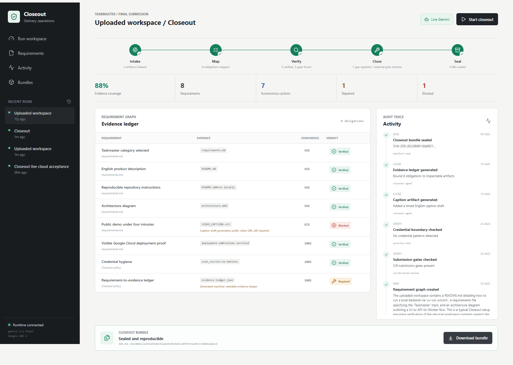
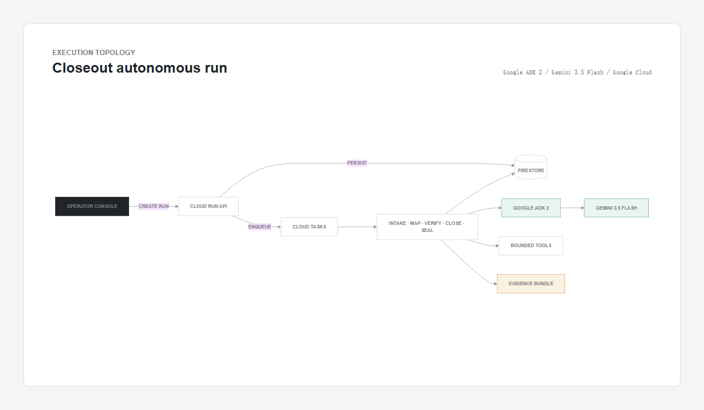

# Closeout

Closeout is an autonomous last-mile agent for high-stakes deliverables. Give it
a project workspace and it maps requirements to evidence, runs policy-bounded
checks and repairs in the background, then seals a reproducible audit bundle.

Built for the **Taskmaster** track of the 2026 All Things Agentic Hackathon.

**Live app:** https://closeout-7ejjj4sb5a-uc.a.run.app

**Source:** https://github.com/chnoorlee/closeout-agent



## Why it exists

The final 10% of a serious deliverable is fragmented across requirement files,
repositories, verification output, external links, and packaging steps. A static
checklist describes those gaps but cannot close them. Closeout turns the last mile
into a five-stage autonomous workflow:

1. **Intake** inventories supplied artifacts without executing uploaded content.
2. **Map** uses Google ADK and Gemini 3.5 Flash to propose an evidence plan.
3. **Verify** executes only registered, deterministic tools.
4. **Close** performs reversible repairs and preserves real external blockers.
5. **Seal** writes an evidence ledger, hashes every payload artifact, and produces a ZIP.

The operator sees exactly what was verified, repaired, or left blocked. Local
output never masquerades as proof of a cloud deployment or public video.

## Architecture



The production design uses a public Cloud Run API/UI, Firestore for durable run
state and private input artifacts, Cloud Tasks for authenticated background
dispatch, and a private Cloud Run worker. The worker uses Google ADK with Gemini
3.5 Flash for planning; all effects pass through a deterministic allowlist.

See [docs/ARCHITECTURE.md](docs/ARCHITECTURE.md) and
[docs/SECURITY.md](docs/SECURITY.md) for the state machine, retry contract, and
trust boundaries.

## Run locally

Prerequisites: Python 3.11-3.13, `uv`, and Node.js 24.

```powershell
uv sync --extra dev
Set-Location frontend
npm ci
Set-Location ..
uv run uvicorn backend.app.main:app --reload --port 8081
```

In a second terminal:

```powershell
Set-Location frontend
npm run dev -- --port 5173
```

Open `http://localhost:5173`. With no Google credentials the runtime identifies
itself as `deterministic-demo`, so the full workflow remains inspectable offline.

## Use live Gemini

Gemini API:

```powershell
$env:GOOGLE_API_KEY = "your-key"
$env:CLOSEOUT_MODEL = "gemini-3.5-flash"
uv run uvicorn backend.app.main:app --port 8081
```

Vertex AI with Application Default Credentials:

```powershell
$env:GOOGLE_GENAI_USE_VERTEXAI = "true"
$env:GOOGLE_CLOUD_PROJECT = "your-project-id"
$env:GOOGLE_CLOUD_LOCATION = "global"
$env:CLOSEOUT_MODEL = "gemini-3.5-flash"
uv run uvicorn backend.app.main:app --port 8081
```

Do not commit secrets. Copy `.env.example` only as a local reference.

## Verify

```powershell
uv run ruff check backend
uv run mypy backend/app
uv pip check
uv run pytest -W error --cov=backend.app --cov-report=term-missing
Set-Location frontend
npm run typecheck
npm test
npm run build
npm run e2e
```

The critical browser journey uploads real in-memory workspace files, watches the
five stages complete, checks evidence counts, downloads the bundle, and exercises
desktop and mobile layouts. Current evidence is recorded in
[docs/TEST_EVIDENCE.md](docs/TEST_EVIDENCE.md).

## Container and Google Cloud

```powershell
docker build -t closeout:local .
docker run --rm -p 8080:8080 closeout:local
```

For the production topology, authenticate `gcloud` against a billing-enabled
project, then run:

```powershell
.\scripts\deploy.ps1 -ProjectId "your-project-id" -Region "us-central1"
```

The script creates the required APIs, service accounts, least-privilege IAM,
Firestore database, Cloud Tasks queue, private worker, and public application.
Deployment and rollback details are in [docs/DEPLOYMENT.md](docs/DEPLOYMENT.md).

## Submission assets

- [Devpost copy](docs/DEVPOST_SUBMISSION.md)
- [Demo script](docs/DEMO_SCRIPT.md)
- [Public build post](docs/PUBLIC_BUILD_POST.md)
- [Public demo video](https://youtu.be/E83TGwgERqE)
- [Architecture source](docs/architecture.mmd)
- [Acceptance contract](docs/ISSUE.md)

## Evidence boundary

The public service, repository, and 82-second public demo video are live and
independently verified. The Devpost acceptance receipt remains an external
requirement until Devpost confirms the final submission.

## License

MIT. See [LICENSE](LICENSE).
