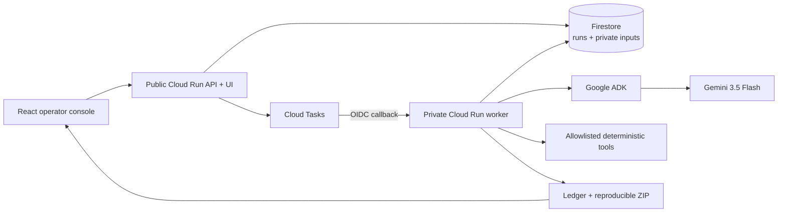

# Closeout architecture

## Production topology

| Component | Responsibility |
| --- | --- |
| React/Vite console | Intake, progress, evidence inspection, bundle download |
| FastAPI service | Validation, run lifecycle, health and artifact endpoints |
| Firestore | Durable run state and a separate private input collection |
| Cloud Tasks | At-least-once, authenticated workflow dispatch |
| Cloud Run worker | Five-stage orchestrator and bundle creation |
| Google ADK + Gemini | Structured plan proposal within a strict action schema |
| Tool registry | The sole gate for every executable effect |

## Control loop

The workflow persists every stage transition and audit event. Gemini returns a
validated `AgentAnalysis` object whose proposed actions are constrained by a
literal allowlist. Policy-required actions are then added deterministically.
Execution can only occur through `execute_tool`; a model response cannot name a
shell command, import code, or bypass the registry.

Stages are `intake -> map -> verify -> close -> seal`. The workflow records a
requirement-to-evidence ledger and computes manifest hashes using stable ZIP
metadata, so identical inputs produce identical bundle bytes.

## Persistence and retry

Cloud Tasks is at-least-once. A completed idempotency key is a no-op, a recent
running lease is left alone, and failed or stale runs are resumed from persisted
inputs. Derived records are rebuilt while prior audit history is retained. An
exception is persisted as a failed run and re-raised so Cloud Tasks receives a
non-2xx response and applies its retry policy.

## Local adapters

Local development replaces Firestore with an in-memory repository and Cloud
Tasks with an in-process background dispatcher. It uses the same workflow and
tool policy, but the UI labels it `deterministic-demo`. This mode demonstrates
behavior; it is not cloud-execution evidence.
